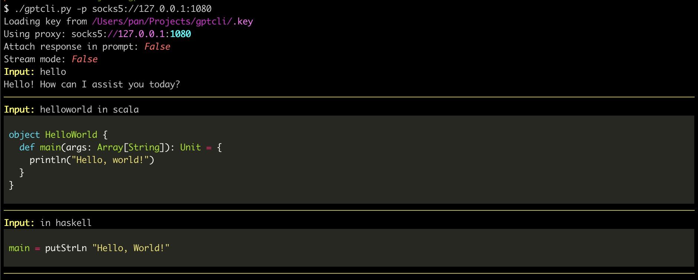
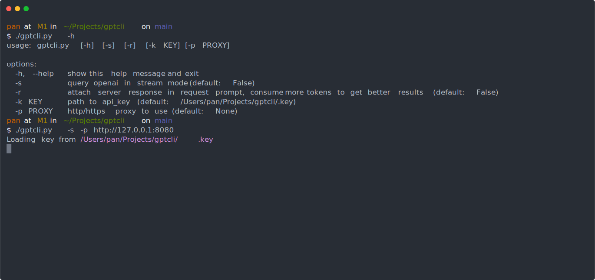

# Setup

1. clone this repo
2. pip3 install -U -r requirements.txt
3. get your apikey from <https://platform.openai.com/account/api-keys> and put it in `.key`

# Run

```sh
$ ./gptcli.py -h
usage: gptcli.py [-h] [-r] [-k KEY] [-p PROXY]

options:
  -h, --help  show this help message and exit
  -s          query openai in stream mode (default: False)
  -r          attach server response in request prompt, consume more tokens to get better results (default: False)
  -k KEY      path to api_key (default: .key)
  -p PROXY    http/https proxy to use (default: None)
```

Console help:

```
$ gptcli.py 
Loading key from .key
Attach response in prompt: False
Input: help
options:
  <        input multiline
  reset    reset session, i.e. clear chat history
  help     show this help message
  exit     exit console
```

# Feature

- [x] Session based
- [x] Markdown support
- [x] Syntax highlight
- [x] Proxy support
- [x] Multiline input
- [x] Stream output


> NOTE: openai's library use aiohttp for stream mode request, and `aiohttp` only supports http/https proxy, but not socks5.
> see: https://github.com/aio-libs/aiohttp/pull/2539

# Example



Stream mode:

[][vid]

# LINK

- https://platform.openai.com/docs/introduction
- https://platform.openai.com/docs/api-reference/completions

[vid]: https://asciinema.org/a/564580
